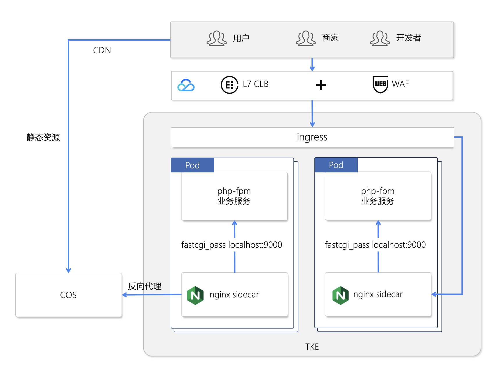
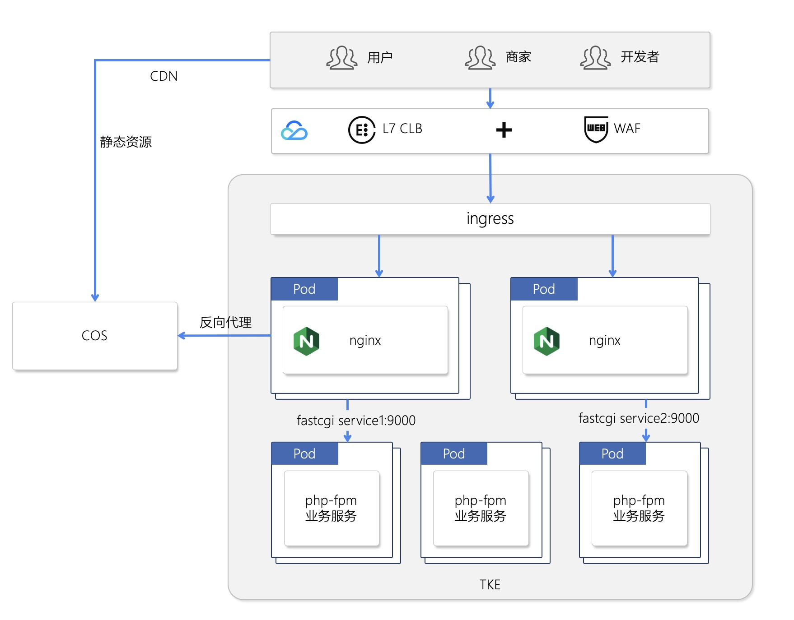
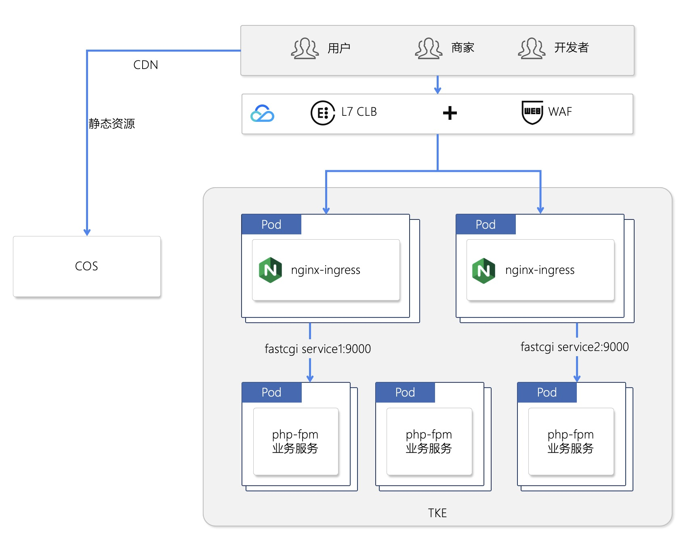
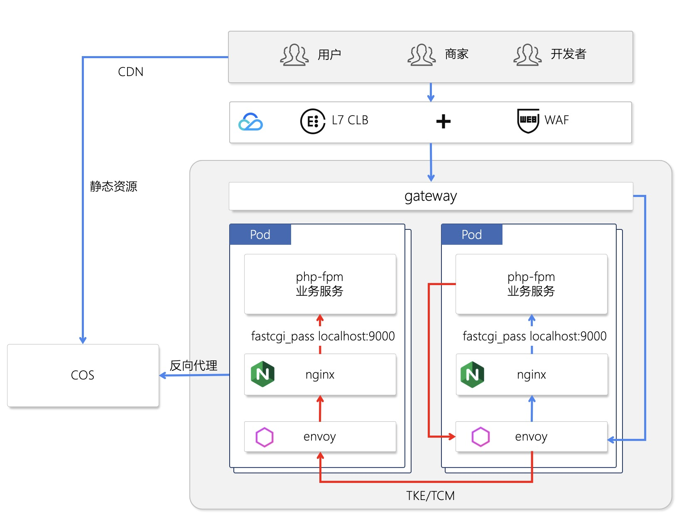

​目前市场上 php 仍有一席之地。本文章将探讨如何将 php 应用容器化并迁移部署到 TKE。 

# php 应用镜像准备
镜像的层次：基础依赖镜像->运行框架->应用/代码镜像

基于容器的单进程运行理念，下面的部署过程并未使用单体的 nginx+php-fpm 一体的容器运行方式，而是将 php-fpm 和 nginx 拆散。

## 基础镜像
安装基础系统依赖包和公司 php 应用中各个开发小组都会用到的扩展包。
下面的示例基于官方 fpm，安装了通用系统级的依赖和 php 包管理器。
如果可以，建议使用更基础的镜像从 php 源码进行编译。

```Dockerfile
# runtime.Dockerfile
FROM php:8.0.3-fpm

# 自定义类库示例
RUN apt-get update && \
    apt-get install -y git zlib1g-dev libpng-dev libicu-dev
RUN docker-php-ext-install \
    gd \
    intl
RUN docker-php-ext-configure intl


# 安装 composer
RUN curl -sS https://getcomposer.org/installer | php -- \
    --install-dir=/usr/local/bin --filename=composer \
    && chmod +x /usr/local/bin/composer 
```

将上述文件编译成镜像，并 push 到仓库：

```shell
docker build -t cloudbeer/php-runtime:1.0 -f runtime.Dockerfile .
docker push cloudbeer/php-runtime:1.0
```

## 应用层框架镜像
如果开发框架比较稳定，建议直接把框架打包成基础镜像以避免后续部署过程中频繁安装依赖包，加速发布打包发布过程，如业务开发A组使用了 lumen 框架，我们可以专门为 lumen 打一个镜像。

如下镜像，安装了 lumen web 框架。

```Dockerfile
# lumen.Dockerfile
FROM cloudbeer/php-runtime:1.0

RUN mkdir /app
WORKDIR /app

RUN echo '{\
    "require": {\
    "php": "^7.3|^8.0",\
    "laravel/lumen-framework": "^8.0"\
    }\
 }' > composer.json

RUN composer i
```

上述镜像打包为：cloudbeer/my-lumen:1.0

## 应用层镜像
由于我们在应用层框架里已经把 lumen 运行时都安装好了，所以这个镜像里，只需拷贝纯源码即可。记得创建 .gitignore 或者 .dockerignore 文件，排除 vender，test 等目录。
```
# .dockerignore
/vendor
/tests
/.idea
/.git
.gitignore
Dockerfile
Homestead.json
Homestead.yaml
.env
.ent.example
.phpunit.result.cache
```

应用镜像里只需要拷贝脚本文件即可。这个镜像包含了完整的 php 运行时和业务代码，启动后可以直接接收 fastcgi 调用。

```Dockerfile
FROM cloudbeer/my-lumen:1.0
COPY ./ /app/
```

上面的镜像打包为： cloudbeer/php-caculate:1.0

另一种打包代码方式，我们使用纯的容器将源代码打包，后面会在 K8S 中部署时将文件拷贝到框架运行时容器中运行。

```Dockerfile
FROM debian:buster-slim
RUN mkdir /app
COPY ./ /app/
```

上面的镜像打包为： cloudbeer/php-caculate-purecode:1.0

代码层在还可以有更多的打包方式，如上传到对象存储里，或者使用 NFS 存储，后期绑定到容器运行时运行。


## 本地测试

启动镜像 cloudbeer/php-caculate:1.0

```
docker run --rm -it cloudbeer/php-caculate:1.0 sh

# 容器内运行
# 启动 php 测试
php -S localhost:8000 -t public &
# 查看结果
curl http://localhost:8000/cpu
```
完美运行。

目前已经完成了应用镜像打包。其中前两层镜像可以复用，真正的业务应用只需拷贝代码。

上述代码中的镜像，我均已打包上传到 docker hub 官网，可以忽略 build 和 push 过程，直接进行测试。


# 部署到 K8S/TKE

php 应用部署到容器环境，最自然的一种方式是：直接将 php 的运行环境和web server 以及业务源代码打包放在一个容器中运行。这个方式是最简单的方式，php 官方也提供了 php:nginx 这种镜像底包。

但 php 运行时和 web server 是在两个进程中运行，这个不符合容器的最佳实践。一般建议将这两个进程分别运行在不同的容器中。

## nginx 作为 sidecar 运行

K8S 在同一个 pod 中，可以运行多个容器。我们将 php-fpm 的业务代码部署在一个容器中，与之相伴生的有一个 nginx 容器，nginx 作为fastcgi的调用方，并可以代理一些静态资源，这个模式类似 mesh 的sidecar 模式。架构图如下：



### nginx 配置
由于 nginx 和 php-fpm 在一个 pod 中，所以只需发起 localhost 调用即可。 nginx 的配置如下，我们将这个配置写到 cm 中，后面通过 volume 绑定到容器中。这个配置有几点需要注意的：
- 应用使用了 lumen 的 route 体系，所以需要将路由通过 try_files 全部指向 ./public/index.php 文件。
- fastcgi_param  SCRIPT_FILENAME  /app/public/index.php 这里也将所有脚本指向这个文件。

```yaml
# nginx config
apiVersion: v1
kind: ConfigMap
metadata:
    name: caculate-sidecar-config
    namespace: php-test
data:
    config: |-
      server {
          listen       8081;
          root   /app/public;
          index index.php
          charset utf-8;

          location / {
            try_files $uri $uri/ /index.php?$args;
          }

          location ~ \.php$  {
            fastcgi_pass   127.0.0.1:9000;
            fastcgi_index  index.php;
            fastcgi_param  SCRIPT_FILENAME  /app/public/index.php;
            include        fastcgi_params;
          }
      }
```

### 应用部署脚本

在下面的部署脚本中，有几点值得关注一下：
- 使用了 emptyDir:{} 作为容器的源代码存储介质，这样可以将应用读取到临时目录中，加速运行时 php 源码的加载。如果脚本文件不大，可以指定 emptyDir 使用内存运行，这个可以更加加速脚本加载。
- pod 启动的时候使用了 2 个 初始化容器，使用的镜像分别是：极简源代码的镜像(php-caculate-purecode)和框架运行时镜像(my-lumen)，在启动的时候分别将 /app 的代码拷贝到了 emptyDir 卷中，分别拷贝了lumen的 vendor 依赖和业务源代码。这里拷贝业务源代码过程亦可以使用 cfs 或者 cos 来实现。由于使用了宿主机存储源代码，当源代码过于庞大的时候，请注意超出宿主机存储容量风险。
- 由于源码和依赖包都已经在 initContainers 组织好了，所以，只需要使用 php 基础容器来启动应用即可。


```yaml
apiVersion: apps/v1
kind: Deployment
metadata:
  name: caculate-nginx-sidecar
  namespace: php-test
  labels: 
    app: caculate-nginx-sidecar
spec:
  replicas: 1
  selector:
    matchLabels:
      app: caculate-nginx-sidecar
  template:
    metadata:
      labels:
        app: caculate-nginx-sidecar
    spec:
      volumes:
      # web app 的工作目录
      - name: webapp-data
        emptyDir: {}
      # nginx 的配置文件，从 cm 中绑定过来
      - name: nginx-php-config
        configMap:
          name: caculate-sidecar-config
          items:
          - key: config
            path: caculate-sidecar.conf
      # 初始化，将镜像中的源文件拷贝到容器内存。
      initContainers:
      - name: copy-code
        image: cloudbeer/php-caculate-purecode:1.0
        volumeMounts:
        - name: webapp-data
          mountPath: /webapp
        command: [cp, -R, /app/, /webapp]
      - name: copy-lumen
        image: cloudbeer/my-lumen:1.0
        volumeMounts:
        - name: webapp-data
          mountPath: /webapp
        command: [cp, -R, /app/, /webapp]
      containers:
      # fpm 应用运行环境
      - name: caculate
        image: cloudbeer/php-runtime:1.0
        resources:
          requests:
            memory: "1Gi"
            cpu: "500m"
          limits:
            memory: "1Gi"
            cpu: "500m"
        ports:
        - containerPort: 9000
          protocol: TCP
        volumeMounts:
        - name: webapp-data
          mountPath: /app
          subPath: app
      # nginx sidecar
      - name: nginx-sidecar
        image: nginx:alpine
        volumeMounts:
        - name: nginx-php-config
          mountPath: /etc/nginx/conf.d/caculate-sidecar.conf
          subPath: caculate-sidecar.conf
        - name: webapp-data
          mountPath: /app
          subPath: app
---
```

挂一个 LoadBalancer 看看。

```yaml
apiVersion: v1
kind: Service
metadata:
    name: caculate-sidecar-service
    namespace: php-test
spec:
    type: LoadBalancer
    selector:
        app: caculate-nginx-sidecar
    ports:
        - protocol: TCP
          port: 8081
          targetPort: 8081
```
访问对应的 外部 ip:8081，完美运行。

## nginx 独立部署

通常情况下，运维部门希望将 web server 收敛并统一管理，开发也不太关心 nginx 的具体配置，将两者进行拆分众望所归，并且在微服务的横向扩展中，这种方式也更加“优雅”。

部署架构图如下：




### 部署 fpm 业务应用
- 此处部署了 php-caculate 镜像，此镜像里包含了源代码，Web框架以及 php 运行时，是一个完整的 php-fpm 业务应用。
- 通过 service 发布应用，以便 nginx 能发现 fpm 服务，并解偶了 webserver 和 业务服务。后期可以做纯php 业务的横向扩展和 nginx 的集中管理。

```yaml
# 为 php-fpm 部署 service
apiVersion: v1
kind: Service
metadata:
  name: caculate-standalone
  namespace: php-test
  labels:
    app: caculate-standalone
spec:
  ports:
  - port: 9000
    name: tcp
  selector:
    app: caculate-standalone

---   
# 部署具体应用
apiVersion: apps/v1
kind: Deployment
metadata:
  name: caculate-standalone
  namespace: php-test
  labels: 
    app: caculate-standalone
spec:
  replicas: 1
  selector:
    matchLabels:
      app: caculate-standalone
  template:
    metadata:
      labels:
        app: caculate-standalone
    spec:
      containers:
      - image: cloudbeer/php-caculate:1.0
        name: caculate
        resources:
          requests:
            memory: "1Gi"
            cpu: "500m"
          limits:
            memory: "1Gi"
            cpu: "500m"
        ports:
        - containerPort: 9000
          protocol: TCP
```

### nginx 部署

此部分的 nginx 配置基本和上面一样，唯一的区别就是 fastcgi_pass 的调用目标变成了 php 业务的 service：caculate-standalone 了。

```yaml
apiVersion: v1
kind: ConfigMap
metadata:
    name: caculate-standalone-config
    namespace: php-test
data:
    config: |-
      server {
          listen       8081;
          root   /app/public;
          index index.php
          charset utf-8;

          location / {
            try_files $uri $uri/ /index.php?$args;
          }

          location ~ \.php$  {
            fastcgi_pass   caculate-standalone:9000;
            fastcgi_index  index.php;
            fastcgi_param  SCRIPT_FILENAME  /app/public/index.php;
            include        fastcgi_params;
          }
      }
```

下面为 nginx 配置单独 pod 启动。

```yaml
apiVersion:  apps/v1
kind: Deployment
metadata:
    name: caculate-standalone-nginx-deployment
    namespace: php-test
spec:
    selector:
        matchLabels:
          app: nginx
    template:
        metadata:
          labels:
              app: nginx
        spec:
          containers:
          - name: nginx
            image: nginx:alpine
            volumeMounts:
            - name: nginx-php-config
              mountPath: /etc/nginx/conf.d/caculate-standalone.conf
              subPath: caculate-standalone.conf
          volumes:
              - name: nginx-php-config
                configMap:
                  name: caculate-standalone-config
                  items:
                  - key: config
                    path: caculate-standalone.conf
```

现在，给 nginx 应用挂一个 LoadBalancer 测试一下，亦完美运行。


## 使用 nginx-ingress 部署

上面的部署架构图中，ingress 和 nginx 分别进行了部署，但  nginx-ingress  其实已经合并了这两个部分，并且 TKE  提供了现成的 nginx-ingress。现在，我们试试使用 nginx-ingress 部署。




在 TKE 集群内安装 nginx-ingress，参考这篇：
https://cloud.tencent.com/document/product/457/50503

使用上面的已经部署好的 fpm 业务的service: caculate-standalone 。

部署脚本如下：
- ingress.class 的值是创建 nginx-ingress 时候在控制台定义的。
- 与纯 nginx 配置不同，nginx-ingress 无需配置 try_files 节点，下面的配置其实已经将全部请求转发到了 public/index.php。

```yaml
apiVersion: v1
kind: ConfigMap
metadata:
  name: caculate-nginx-ingress-config
  namespace: php-test
data:
  SCRIPT_FILENAME: "/app/public/index.php"
---  
apiVersion: networking.k8s.io/v1beta1
kind: Ingress
metadata:
  annotations:
    kubernetes.io/ingress.class: "your-ingress-class"
    nginx.ingress.kubernetes.io/backend-protocol: "FCGI"
    nginx.ingress.kubernetes.io/fastcgi-index: "index.php"
    nginx.ingress.kubernetes.io/fastcgi-params-configmap: "caculate-nginx-ingress-config"
  name: caculate-nginx-ingress
  namespace: php-test
spec:
  rules:
  - http:
      paths:
      - backend:
          serviceName: caculate-standalone
          servicePort: 9000
```
TKE 的 nginx-ingress 直接提供了一个外网地址，访问一下试试，完美运行。


## MORE：mesh 化

在 php mesh 化中，需要考虑的问题如下：
- fastcgi 使用 TCP 协议，并且有自己的序列化方法，此特性并未在 istio 和 envoy 中支持，无法进行精细的流量控制。
- fpm + envoy sidecar 可以实现服务级别的流量控制。 fpm + nginx-sidecar + envoy sidecar 将 fastcgi 调用转化为 http 调用，可以实现基于 http 协议的精细流量控制。
- 实现调用链监控，需要使用 http 进行远程调用，有可能需要改造代码，在header 中封装 opentracing 。

当下，php mesh 的部署模式建议采用 fpm 业务层，nginx-sidecar， envoy-sidecar 三个容器为一个pod 的部署模式。

架构图如下：




此处的部署与第一部分的内容 - nginx 作为 sidecar 运行类似，在腾讯云中需要开通 TCM，并注入 envoy 的 sidecar。


---

本文相关的源代码说明：
位置：https://github.com/cloudbeer/php-best-practice

## src/lumen-app/
php 业务应用，映射了2个路径
- /cpu： 两种方式计算了 pi
- /mem: 在数组里塞了字符串为了撑爆内存

## deployments/ 
部署代码
app-caculate-fpm-separate.yaml： nginx 和 fpm 分在不同的 pod 中部署
app-caculate-nginx-ingress.yaml： nginx-ingress 直接代理 fpm 服务
app-caculate-nginx-sidecar.yaml： nginx 和 fpm 部署在同一个pod中的两个容器

## dockerfile/
lumen.Dockerfile：包含 lumen 框架的运行环境
runtime.Dockerfile：php 基础运行环境

业务代码的 Dockerfile 位于 src/lumen-app/Dockerfile 和 src/lumen-app/purecode.Dockerfile


